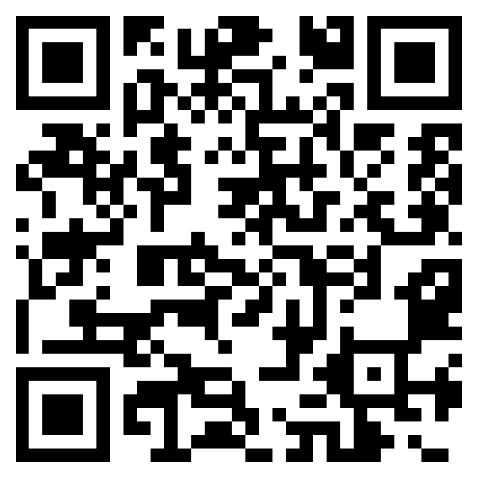

# NeuroQuest Zen Pro — Pilot Handbook

**Version 1.0 · May 2026**
**For:** Whitney Ausbrooks (Owner) + Pilot Company Admins + Pilot Participants

---

## How to use this handbook

This handbook has **two parts**. Read whichever applies to you:

- **Part 1 — Owner Handbook (Whitney)** — How to set up, run, and convert pilots. Sales talking points, lifecycle, troubleshooting, what to say when things break. Pages 1–6.
- **Part 2 — Pilot Group Handbook** — A self-contained packet you can send to a pilot company. Has two sub-sections: one for the **Company Admin** (the HR/People-Ops person who signed up) and one for the **Employee/Participant** (the person installing the app). Pages 7–12.

When you sign a new pilot, send them Part 2 only.

---

# PART 1 — OWNER HANDBOOK

*Internal. Not for distribution to pilot companies.*

---

## 1. What you're actually selling

A 75-day proof-of-concept where a company's employees voluntarily install NeuroQuest Zen Pro, connect Apple Health (or Health Connect), and start contributing to a **team-level Neuro Resilience baseline**. The company admin gets a dashboard of **aggregated wellness signals** (HRV trend, sleep trend, engagement) — anonymized so no individual employee is ever identifiable.

Your value proposition to the company:

> *"You can't fix burnout you can't see. NeuroQuest gives you the earliest measurable signal — drops in HRV, sleep, and engagement against your team's own baseline — so your People Ops team can intervene with workload, PTO, or coaching before someone quits or breaks down. We promise zero individual surveillance: aggregates only, minimum 5 employees per bucket. Your employees keep their data private; you get the trend."*

Your value proposition to the employee:

> *"Your company is paying for a tool that helps you catch your own decline early. Your individual data is yours alone — your boss never sees your HRV or your sleep. You see your Neuro Resilience Score; they see only aggregated team trends. Plus 1% of subscription revenue funds Feeding America."*

## 2. Pricing & commercial structure

| Tier | Price | Notes |
|---|---|---|
| **Enterprise (paid)** | $12/seat/month | Stripe-billed monthly, charged via `stripe-enterprise.ts` |
| **Pilot (free, 75 days)** | $0 | Auto-converts to paid at pilot end if not cancelled |
| **Individual Monthly** | $9.99/mo | Direct-to-consumer via App Store IAP |
| **Individual Annual** | $79.99/yr | Same |
| **Founder (one-time)** | $199.99 | Lifetime, limited cohort |
| **Daily Pass** | $5.99 | 24h trial access |

**Compassion Loop:** 1% of net subscription revenue is donated to **Feeding America**. Don't promise a specific dollar amount — promise the percentage and the cause.

## 3. The 75-day pilot lifecycle

| Day | What you do | What the admin does | What employees do |
|---|---|---|---|
| **−7** | Send pilot agreement + Part 2 of this handbook | Reviews privacy promises with their legal/HR | — |
| **0** | Run the `onboard-pilot` curl (see §4). Email the admin their invite code. | Forwards invite code to employees with the launch email template (§7) | Install app, enter invite code, connect Apple Health |
| **+7** | Pull dashboard, confirm ≥5 employees joined | Logs into company admin dashboard for first time | Continue daily use; background sync handles refresh |
| **+14** | Baselines establish. Algorithm flips from absolute-threshold to baseline-relative scoring. | Sees first meaningful aggregate trend | Notices their personal Neuro Resilience Score sharpens |
| **+30** | Send mid-pilot check-in: % active, engagement rate, any team-level signal worth flagging | Reviews aggregate trend report with their People Ops team | — |
| **+60** | Conversion conversation. Are they seeing value? What would make this a yes? | Decides: convert, extend, or sunset | — |
| **+75** | Pilot ends. Either: (a) Stripe subscription kicks in at $12/seat/mo, or (b) data is exported + deleted per agreement | — | App continues to work for individual users who want to keep their own subscription |

## 4. How to create a new pilot

**Step 1 — Create the company (one API call):**

```bash
curl -X POST https://neuroquestzen.pro/api/enterprise/onboard-pilot \
  -H "Authorization: Bearer $ADMIN_MASTER_KEY" \
  -H "Content-Type: application/json" \
  -d '{
    "company_name": "Acme Corp",
    "admin_email": "hr@acmecorp.com",
    "seats": 50,
    "pilot_days": 75,
    "industry": "Tech"
  }'
```

You'll get back an 8-character `invite_code` (e.g. `K7P9X2MN`). **That's the magic string.**

**Step 2 — Generate the per-pilot QR code:**

```bash
./scripts/generate-pilot-qr.sh K7P9X2MN "Acme Corp"
# → attached_assets/pilots/acme-corp_K7P9X2MN_qr.png
```

The QR encodes `https://neuroquestzen.pro/join?code=K7P9X2MN`. When a participant scans it with their phone camera, the join page opens with the code **already pre-filled and the company lookup auto-triggered** — they just type their name and work email, hit Join, and they're in. No typing the 8 characters wrong, no support tickets about typos.

**Step 3 — Email the admin** the invite code + the QR PNG + Part 2 of this handbook. Use the launch email template in §7.

For the full technical onboarding (SSO, SCIM, custom branding), see `COMPANY_ONBOARDING_PLAYBOOK.md`.

## 5. How to monitor a live pilot

| Question | Endpoint | Notes |
|---|---|---|
| How many companies do I have? | `GET /api/enterprise/companies` | Returns all pilots + paid customers |
| How many seats are filled in Acme's pilot? | `GET /api/enterprise/seats/:companyId` | Filled vs. cap |
| Aggregate dashboard for Acme | `GET /api/enterprise/company/:companyId/dashboard` | Same view their admin sees |
| Team heatmap | `GET /api/enterprise/team-heatmap/:companyId` | Department × wellness signal |
| Audit log of admin actions | `GET /api/enterprise/audit-log` | Every join, every score read |
| Revenue summary | `GET /api/enterprise/revenue/summary` | Recognized vs deferred |

All require `Authorization: Bearer $ADMIN_MASTER_KEY`.

## 6. Things that will break in production (and what to say)

| Symptom | Cause | What to tell them |
|---|---|---|
| Employee joins but score never updates | They didn't grant Apple Health, OR they're on Android (background sync not yet wired) | "Open Settings → Privacy → Health → NeuroQuest → enable all. On Android, open the app once per day until our next release." |
| Admin can't see any aggregate trends | Fewer than 5 employees in a bucket | "By design — we don't show aggregates below 5 to protect individual privacy. Once you cross 5 in any department, the bucket lights up." |
| Score seems too low for healthy person | Apple Watch hasn't established a 14-day baseline yet | "The score uses absolute HRV thresholds for the first 14 days, then switches to baseline-relative. The first 2 weeks may read lower than expected — that's expected behavior, not a bug." |
| Employee deleted the app — are they still being tracked? | No. Data sync stops when the app is removed. | "When the app is uninstalled, the Apple Health permission is automatically revoked by iOS. No further data is collected. Their historical data stays in your aggregate baseline unless you ask us to delete it." |
| Pilot ends, company didn't decide yet | Subscription transitions from `trialing` to `active` automatically | Reach out 14 days before pilot ends to lock in conversion or extension. Don't let auto-billing surprise anyone. |

## 7. Launch email template (for admin to send their employees)

Customize and hand to the admin:

> **Subject:** New benefit: NeuroQuest Zen Pro — your wellness, your data
>
> Team,
>
> We're piloting **NeuroQuest Zen Pro**, an AI-personalized wellness app that uses your Apple Watch or wearable to help you spot energy declines early — before they turn into burnout.
>
> **What you need to know:**
> - **Your data is yours.** Your individual HRV, sleep, and steps are never shared with anyone at [Company]. Not me, not your manager, not HR. We see only aggregated team trends, and only when at least 5 teammates are participating in a bucket.
> - **It's voluntary.** No pressure to join. No tracking if you don't.
> - **Setup takes 3 minutes.** Download from the App Store, enter the invite code below, connect Apple Health.
>
> **To join:**
> 1. Download **NeuroQuest Zen Pro** from the App Store (link)
> 2. Choose "Join with company invite"
> 3. Enter invite code: **`[INVITE_CODE_HERE]`**
> 4. Use your work email so we can match seats to our pilot
> 5. Connect Apple Health when prompted
>
> Questions? Reply to this email or check the participant guide attached.
>
> [Admin name]

## 8. Conversion playbook (Day 60)

When the 60-day check-in comes around, walk the admin through three numbers:

1. **Adoption rate** — % of invited employees who actually joined. >40% is good, >60% is excellent. Below 30%, the company didn't promote it internally — coach them on a relaunch.
2. **Engagement rate** — % of active users in the last 7 days. >70% means the tool is sticky.
3. **Detected signal** — any departments showing meaningful HRV/sleep decline vs. their own 30-day baseline. If yes, this is your conversion pitch: *"You couldn't have seen this without us."*

If all three are strong, ask for the conversion at the call. If two of three are strong, propose a 30-day extension. If one or zero are strong, accept the loss gracefully and ask what would have made it work — that's the most valuable data you'll get all year.

## 9. Red flags to escalate immediately

- **Any admin asking for individual employee data** — refuse. Politely. Cite the privacy promise in writing. This is the cornerstone of the product and a single breach kills the brand.
- **Any pilot company that didn't tell their employees the data is voluntary** — pause the pilot, demand a corrected announcement.
- **Any media inquiry about the algorithm** — defer to your published research-grounded language; do NOT make clinical or diagnostic claims. (See marketing copy audit notes.)
- **Any employee reporting their boss confronted them about a score** — major breach. Get the employee on the phone, confirm what was disclosed and how. The leak is either a bug or an admin who violated the agreement.

---

# PART 2 — PILOT GROUP HANDBOOK

*Send this to the pilot company. Has two sub-sections — Admin and Participant.*

---

## Welcome to the NeuroQuest Zen Pro Pilot

Your team has been invited to a **75-day pilot** of NeuroQuest Zen Pro — a wellness platform that helps your employees catch energy declines before they turn into burnout, while giving you (the People Ops admin) aggregated insights into your team's wellness without ever exposing individual data.

This packet has two sections:
- **Section A — For the Company Admin** (you, the person who signed up)
- **Section B — For the Participant** (your employees)

Forward Section B to your team.

---

## Section A — Company Admin Guide

### A1. Your invite code + QR code

You'll receive two things by email:
1. An **8-character invite code** (e.g. `K7P9X2MN`)
2. A **PNG QR code** for your pilot

The QR code is the fastest way to onboard your team. When scanned with a phone camera, it opens the join page with your invite code already filled in — participants just enter their name and work email. Drop the PNG into your launch email, print it on a poster for the break room, paste it into a Slack announcement, or include it on your benefits-overview slide.

**Treat the invite code like a password for your pilot.** Anyone with the code (or the QR) can claim a seat. If you suspect it's been shared outside your org, contact us to rotate it.

### A2. What you can see

Log in at `https://neuroquestzen.pro/admin` with your admin email + invite code.

You can see:
- **Total seats filled** out of your pilot cap
- **Active users** in the last 7 / 30 days
- **Aggregate Neuro Resilience trend** for your whole team
- **Department heatmap** — but only departments with ≥5 active employees
- **Engagement metrics** — daily app opens, exercise completions, streak counts

### A3. What you cannot see

- **Any individual employee's score**
- **Any individual's HRV, sleep, or step data**
- **Who connected their Apple Watch and who didn't**
- **Anyone's name, email, or identifiable info attached to a wellness number**

Aggregates only. Minimum 5 employees per bucket. This is not a setting you can change — it's enforced in the database. If a department has 4 people, you'll see no data for that department until a 5th person joins.

### A4. How to launch internally

1. **Before announcing:** Make sure your team knows participation is voluntary. We've drafted a launch email — ask us for it.
2. **Day of launch:** Send the email with the invite code. Pin it in your team channel.
3. **Day 3:** Send a reminder. First-week adoption is the strongest predictor of pilot success.
4. **Day 14:** Aggregate trends start showing meaningful data once enough employees have a 14-day personal baseline.
5. **Day 30:** First scheduled check-in with NeuroQuest. Bring questions.
6. **Day 60:** Conversion conversation. Decide: convert to paid ($12/seat/month), extend the pilot, or sunset.
7. **Day 75:** Pilot ends. Either subscription begins or all data is exported and deleted per your preference.

### A5. Privacy promises in writing

By accepting this pilot, NeuroQuest commits to you:

1. **Aggregates only.** No bucket smaller than 5 employees is ever displayed in your dashboard.
2. **No name-to-number mapping ever leaves the database.** Your dashboard sees only anonymized aggregates.
3. **Employees can leave the pilot at any time** by uninstalling the app — no admin approval required.
4. **You will never receive a list of who joined and who didn't.** You see seats filled, not identities.
5. **If you ask for individual data, we will refuse in writing** and notify you that the request violated the pilot agreement.

### A6. What to do if an employee reports a privacy concern

1. Tell them you can't see their individual data and you don't want to.
2. Forward the concern to NeuroQuest support directly: `support@neuroquestzen.pro`
3. We'll investigate, audit the database, and respond in writing within 5 business days.

---

## Section B — Participant Guide

*Hi! Your company is offering you a free wellness app. Here's everything you need to know in 3 minutes.*

### B1. What is NeuroQuest Zen Pro?

A wellness app that reads your Apple Watch (or other wearable) data — heart rate variability, sleep, and steps — and gives you a **personal Neuro Resilience Score**. The score helps you see when your nervous system is running low on reserves so you can rest before you crash.

### B2. Why is my company offering this?

Your employer wants to help you avoid burnout. They're paying for a 75-day pilot so you can use the app for free. **Your participation is voluntary.** Nothing changes for you at work if you don't join.

### B3. What does my employer see?

**Nothing about you specifically.** They see aggregated trends only — like "the engineering department's average sleep dropped 8% this week" — and only when at least 5 people in a bucket are participating. They cannot see:
- Your individual score
- Your individual sleep, HRV, or steps
- Whether you joined or not
- Your name attached to any wellness data

This is enforced at the database level, not just a policy. Your data stays yours.

### B4. How to set up

**Fastest path — scan this QR code with your phone camera:**



*Opens https://neuroquestzen.pro — from there, tap the App Store or Play Store badge.*

**Or follow the steps manually:**

1. **Download** NeuroQuest Zen Pro from the App Store (iPhone) or Play Store (Android).
2. **Open the app**, tap **"Join with company invite"**.
3. **Enter** your work email and the **8-character invite code** your admin sent you.
4. **Grant Apple Health (or Health Connect) permissions** when prompted. The app needs three reads:
   - Heart Rate Variability (HRV)
   - Sleep Analysis
   - Step Count
5. **Done.** Your score will populate within 24 hours of your watch syncing new data.

### B5. How the score updates

On **iPhone + Apple Watch**: Fully automatic. The app silently refreshes your score in the background whenever your watch records new data. You don't need to open the app daily.

On **Android**: For now, the score refreshes only when you open the app. (Background sync for Android is coming in a future release.)

### B6. What the score means

| Score range | Meaning |
|---|---|
| **80–100** | Excellent recovery. You're well-rested and your nervous system is in a strong state. |
| **60–79** | Solid. Normal day-to-day variation. |
| **40–59** | Moderate. Consider lighter cognitive load today; prioritize sleep tonight. |
| **20–39** | Low. Your HRV and/or sleep have dropped meaningfully against your baseline. Active recovery recommended. |
| **0–19** | Very low. Prolonged decline detected. Consider rest, PTO, or talking to a coach/doctor if it persists. |

**Important:** The first 14 days are a "calibration window." The score uses general thresholds during that time. After 14 days, it switches to comparing you against **your own baseline** — which is more accurate, especially if you're older or have naturally lower HRV.

The score is a **wellness signal**, not a medical diagnosis. If you have health concerns, talk to your doctor.

### B7. Your privacy in plain English

- The app stores your readings on a secure server keyed to your account.
- Your admin sees aggregates only — minimum 5 people per bucket.
- We never read your location, messages, contacts, photos, or workouts.
- You can disconnect at any time: iOS Settings → Privacy → Health → NeuroQuest → toggle off.
- You can delete your account from inside the app: Profile → Settings → Delete Account. This wipes all your data within 30 days.

### B8. The Compassion Loop

1% of all subscription revenue funds **Feeding America**. When your company pays for your seat, a small portion automatically funds meals for families in need. You're not just taking care of yourself — your participation funds care for others.

### B9. Common questions

**Q: Can I keep the app after the pilot ends?**
A: Yes. If your company doesn't convert to a paid plan, you can subscribe individually ($9.99/mo or $79.99/yr) and keep your data and history.

**Q: Does it work without an Apple Watch?**
A: Yes, but with reduced accuracy. You can manually enter HRV, sleep, and steps daily, OR connect any wearable that syncs to Apple Health (Oura, Whoop, Garmin, Fitbit on iPhone, Eight Sleep, Withings).

**Q: Will this drain my watch battery?**
A: No. We use Apple's standard background-delivery system. Apple's own Health app uses the same mechanism.

**Q: What if I forget my account?**
A: Reach out to `support@neuroquestzen.pro` with your work email.

**Q: Who do I contact for help?**
A: `support@neuroquestzen.pro` — we reply within 24 hours.

---

## Document version & contact

**Version 1.0 · Published May 27, 2026**
**NeuroQuest LLC · Whitney Ausbrooks, Founder**
**Support: support@neuroquestzen.pro**
**Admin support: ops@neuroquestzen.pro**

For the technical onboarding runbook (SSO, SCIM, custom branding, Stripe configuration), see `COMPANY_ONBOARDING_PLAYBOOK.md` in the project repo.
